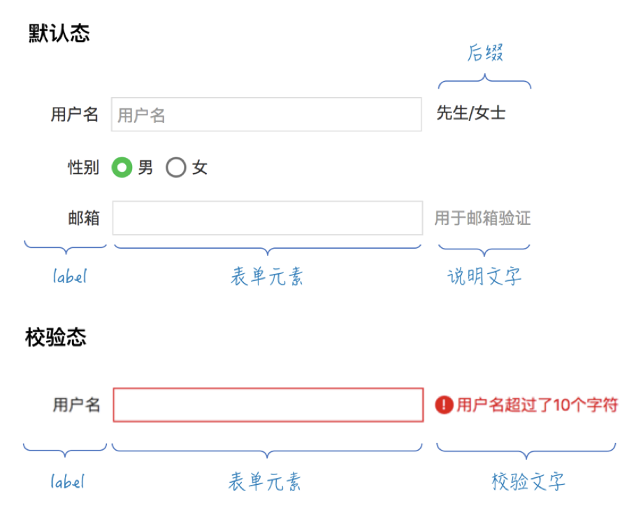

## 特性说明

1、结构上整个组件可划分为 6 个部分：label、前缀、表单元素（placeholder）、后缀、说明文字，校验态。大概如下图：



2、除了常规的表单元素，也可以直接使用 children 自定义一些特殊元素。

3、表单验证采用统一验证的方式，验证的相关正则逻辑使用 [rsuite-schema](https://github.com/rsuite/rsuite-schema)

## 常规使用

```jsx
const initialState = { values: {
  username: '',
  email: '',
  password: '',
  comment: '',
} };
function changeHandler(name, value) {
  setState({
    values: {
      [name]: value,
    },
  });
}
<div>
  <FormItem label="用户名" name="username" value={state.values.username} placeholder="用户名" onChange={changeHandler} />
  <FormItem label="邮箱" name="email" value={state.values.email} type="email" onChange={changeHandler} />
  <FormItem label="密码" name="password" value={state.values.password} type="password" onChange={changeHandler} />
  <FormItem label=""  name="comment" value={state.values.comment} type="textarea" onChange={changeHandler} />
</div>
```

prefix、suffix、des

```jsx
const initialState = { values: {
  username: '',
  email: '',
} };
function changeHandler(name, value) {
  setState({
    values: {
      [name]: value,
    },
  });
}
<div>
<FormItem name="username" prefix="Hello" suffix="先生/女士" placeholder="用户名" value={state.values.username} onChange={changeHandler} />
<FormItem name="email" des="用于验证号码" placeholder="邮箱" value={state.values.email} onChange={changeHandler} />
</div>
```

多个 items 一行显示

```jsx
const initialState = { values: {
  username: '',
  email: '',
} };
function changeHandler(name, value) {
  setState({
    values: {
      [name]: value,
    },
  });
}
<div>
<FormItem inline label="用户名" name="username" value={ state.values.username } onChange={changeHandler} />
<FormItem inline label="邮箱" type="email" name="email" value={ state.values.email } onChange={changeHandler} />
</div>
```

simple 极简模式：结构简单，不包括验证信息

```jsx
const initialState = { values: {
  username: '',
  pwd: '',
} };
function changeHandler(name, value) {
  setState({
    values: {
      [name]: value,
    },
  });
}
<div>
<FormItem simple placeholder="请输入用户名" name="username" value={ state.values.username } onChange={changeHandler} />
<FormItem simple placeholder="请输入密码" type="password" name="pwd" value={ state.values.email } onChange={changeHandler} />
</div>
```

## 特殊化

垂直显示

```jsx
const initialState = { values: {
  age: '',
} };
function changeHandler(name, value) {
  setState({
    values: {
      [name]: value,
    },
  });
}

<FormItem type="number" vertical name="age" value={state.values.age} label="请输入年龄" onChange={changeHandler} />
```

no label

```jsx
const initialState = { values: {
  age: '',
} };
function changeHandler(name, value) {
  setState({
    values: {
      [name]: value,
    },
  });
}

<FormItem type="number" name="age" value={state.values.age} placeholder="请输入年龄" onChange={changeHandler} />
```

元素禁用

```jsx
<FormItem type="textarea" name="comment" value="我是禁用的textarea" disabled />
```

自定义表单元素

```jsx
const initialState = { values: {
  sex: [],
  ids: [],
} };

const list = [
  {
    label: '男',
  },
  {
    label: '女',
  },
  {
    label: '未知',
  },
];

const idsList = [
  {
    content: '身份证',
    value: 1,
  },
  {
    content: '驾驶证',
    value: 2,
  },
  {
    content: '护照',
    value: 3,
  }
]

function fn(data) {
  console.log(data);
  const { values } = state;
  const {name, value} = data;
  values[name] = value;
  setState({
    values,
  });
}
<div>
<FormItem label="性别" name="sex">
  <RadioCheckboxList inline name="sex" list={list} value={state.values.sex} type="radio" onChange={fn} />
</FormItem>
<FormItem label="证件类型" name="ids">
  <Select name="ids" list={idsList} value={state.values.ids} onChange={fn} />
</FormItem>
</div>
```


## 校验处理

默认检验

```jsx
const formErr = {
  username: {
    hasError: true,
    errorMessage: '用户名超过了10个字符',
  },
  email: {
    hasError: false,
  }
}
const initialState = { values: {
  username: '',
  email: '',
} };
function changeHandler(name, value) {
  setState({
    values: {
      [name]: value,
    },
  });
}
<div>
<FormItem label="用户名" name="username" value={ state.values.username } onChange={changeHandler} checkMsg={formErr.username} />
<FormItem label="邮箱" type="email" name="email" value={ state.values.email } onChange={changeHandler} checkMsg={formErr.email} />
</div>
```

inline 形式检验

```jsx
const formErr = {
  username: {
    hasError: true,
    errorMessage: '用户名超过了10个字符',
  },
  email: {
    hasError: false,
  }
}
const initialState = { values: {
  username: '',
  email: '',
} };
function changeHandler(name, value) {
  setState({
    values: {
      [name]: value,
    },
  });
}
<div>
<FormItem inline label="用户名" name="username" value={ state.values.username } onChange={changeHandler} checkMsg={formErr.username} checkMsgShowBelow />
<FormItem inline label="邮箱" type="email" name="email" value={ state.values.email } onChange={changeHandler} checkMsg={formErr.email} checkMsgShowBelow />
</div>
```

将校验信息放在一起显示，不显示在单个的表单项后面

```jsx
const formErr = {
  username: {
    hasError: true,
    errorMessage: '用户名超过了10个字符',
  },
  email: {
    hasError: false,
  }
}
const initialState = { values: {
  username: '',
  email: '',
} };
function changeHandler(name, value) {
  setState({
    values: {
      [name]: value,
    },
  });
}
<div>
<FormItem label="用户名" name="username" value={ state.values.username } onChange={changeHandler} checkMsg={formErr.username} checkMsgHide hideCheckMsg  />
<FormItem label="邮箱" type="email" name="email" value={ state.values.email } onChange={changeHandler} checkMsg={formErr.email} checkMsgHide hideCheckMsg />
</div>
```

## Form

因为 FormItem 组件，每个组件都需要传入 value、checkMsg 及 onChange 事件，所以使用 context 进行了一层封装。大概实现逻辑如下：

- 先在 Form 组件中定义 context，包括 value、checkMsg 及 onChange 三个属性
- 再定义一个高阶组件 FromItemContext，传入 FormItem 组件，使用 context

注：context 使用了 react 16.3.x 引入的新的[context api](https://reactjs.org/docs/context.html)，使用之前请确保升级了 react 到 react 16.3.x。

```jsx
import React, { Component } from 'react';
// 引入 rsuite-schema 来做统一检验
import { SchemaModel, StringType, NumberType } from 'rsuite-schema';
import { Form, FormItemContext, FromItem } from 'react-form-next';


class FormDemo extends Component {
  constructor(props) {
    super(props);
    this.state = {
      values: {
        username: '',
        email: '',
        age: 'N/A',
      },
      formErr: {}, // 校验信息字段
    };

    // 创建检验schema
    this.formModel = SchemaModel({
      username: StringType().isRequired('用户名不能为空'),
      email: StringType().isRequired('邮箱不能为空').isEmail('请输入正确的邮箱'),
      age: NumberType('年龄应该是一个数字').range(18, 30, '年应该在 18 到 30 岁').isRequired('年龄不能为空'),
    });
  }
  handleChange = (name, value) => {
    // age 实时检验
    if (name === 'age') {
      const { formErr } = this.state;
      // checkForField 单个检验
      formErr[name] = this.formModel.checkForField(name, value);
      this.setState({
        formErr: Object.assign({}, formErr),
      });
    }

    this.setState({
      values: {
        [name]: value,
      },
    });
  }

  checkForm = () => {
    // check 全部校验
    this.setState({
      formErr: this.formModel.check(this.state.values),
    });
  }

  render() {
    return (
      <Form values={this.state.values} checkMsg={this.state.formErr} onChange={this.handleChange}>
        <FormItemContext label="用户名" type="text" name="username" />
        <FormItemContext label="邮箱" type="email" name="email" />
        <FormItemContext label="年龄" type="number" name="age" />
        <FormItem label="" name="submit">
          <span className="s-btn s-btn--primary s-btn--m" onClick={this.checkForm}>提交</span>
        </FormItem>
      </Form>
    );
  }
}
```
